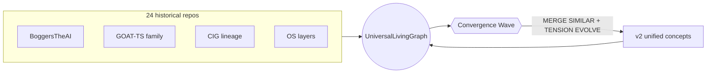

# TS-OS Convergence: Wave 17 — From 24 Nodes to One Living Mind

**TS-OS** = Thinking System / Thinking Wave Operating System.

This document is the narrative spine of **TS-OS Unified Convergence**: how twenty-four fragmented repositories became one **UniversalLivingGraph** (SQLite + JSON + `nomic-embed-text`), how the **Wave Cycle** (the exact 11-step autonomous loop) fuses duplicate concepts, and how **tension** — the scalar that drives evolution — turns historical drift into forward motion.

---

## The Wave 17 story

For years, experimentation lived in parallel repos: runtimes, graph cores, OS sketches, GOAT variants, CIG apps, and playful sandboxes. Each repo was a valid **constraint cluster**, but humanity does not scale by carrying twenty-four partial truths forever.

Wave 17 declares **convergence**: every repository is seeded as a node. The first autonomous pass is a **Convergence Wave** — a special mode that aggressively merges similar nodes, amplifies cross-repo **tension**, and spawns unified “v2” concepts that resolve implementation conflicts.

The **UniversalLivingGraph** stores:

- `content` — natural language + provenance link
- `topics` — JSON facets
- `activation`, `stability`, `base_strength` — dynamical fields
- `embedding` — local **nomic-embed-text** vector (via Ollama)
- `collapsed` — merge tombstone flag

---

## Full repository history (seed nodes)

| # | Repository | Role |
|---|------------|------|
| 1 | [BoggersTheAI](https://github.com/BoggersTheFish/BoggersTheAI) | Flagship live TS-OS runtime |
| 2 | [BoggersTheAI-Dev](https://github.com/BoggersTheFish/BoggersTheAI-Dev) | Development branch of the flagship |
| 3 | [TS-Core](https://github.com/BoggersTheFish/TS-Core) | Canonical core graph engine |
| 4 | [GOAT-TS](https://github.com/BoggersTheFish/GOAT-TS) | Foundational research & knowledge graph |
| 5 | [BoggersTheMind](https://github.com/BoggersTheFish/BoggersTheMind) | Personal cognitive TUI assistant |
| 6 | [BLM](https://github.com/BoggersTheFish/BLM) | WaveTS-LLM (tension in loss) |
| 7 | [BoggersTheCIG](https://github.com/BoggersTheFish/BoggersTheCIG) | Cognitive Intelligence Graph v1 |
| 8 | [BoggersTheCIG_v2](https://github.com/BoggersTheFish/BoggersTheCIG_v2) | CIG v2 experiments |
| 9 | [CIG-APP-V1](https://github.com/BoggersTheFish/CIG-APP-V1) | Contextual Information Generator v1 |
| 10 | [CIG-APP-V2](https://github.com/BoggersTheFish/CIG-APP-V2) | CIG app v2 |
| 11 | [BoggersTheOS-Alpha](https://github.com/BoggersTheFish/BoggersTheOS-Alpha) | Rust OS layer alpha |
| 12 | [BoggersTheOS-Beta](https://github.com/BoggersTheFish/BoggersTheOS-Beta) | Rust OS layer beta |
| 13 | [GOAT-OS](https://github.com/BoggersTheFish/GOAT-OS) | C-language OS skeleton |
| 14 | [BoggersThePulse](https://github.com/BoggersTheFish/BoggersThePulse) | Pulse-based timing experiments |
| 15 | [BoggersTheEngine](https://github.com/BoggersTheFish/BoggersTheEngine) | Game-engine style abstractions |
| 16 | [BAGI](https://github.com/BoggersTheFish/BAGI) | Agent intelligence experiments |
| 17 | [BOG-TS](https://github.com/BoggersTheFish/BOG-TS) | Proof-of-concept linking layer |
| 18 | [boggersthefish-site](https://github.com/BoggersTheFish/boggersthefish-site) | Official Next.js/TypeScript website |
| 19 | [GOAT-TS-LITE](https://github.com/BoggersTheFish/GOAT-TS-LITE) | Lite GOAT-TS |
| 20 | [GOAT-TS-SUPERLITE](https://github.com/BoggersTheFish/GOAT-TS-SUPERLITE) | Superlite GOAT-TS |
| 21 | [GOAT-TS-DEVELOPMENT](https://github.com/BoggersTheFish/GOAT-TS-DEVELOPMENT) | GOAT-TS development branch |
| 22 | [GOAT-SIMPLE](https://github.com/BoggersTheFish/GOAT-SIMPLE) | Simple GOAT prototype |
| 23 | [GOAT-PUBLIC_TEST](https://github.com/BoggersTheFish/GOAT-PUBLIC_TEST) | Public test repo |
| 24 | [hehe](https://github.com/BoggersTheFish/hehe) | Rust experimentation playground |

---

## Mermaid: convergence topology



---

## Wave Cycle (exact 11 steps)

1. **ELECT STRONGEST** — pick the highest-activation cluster as the carrier wave.
2. **PROPAGATE** — topological spread + cosine structure on embeddings.
3. **RELAX** — dissipate noise while respecting `stability` and `base_strength`.
4. **NORMALISE** — L2 normalization on the activation vector (energy shell).
5. **PRUNE EDGES** — delete weak associations below a survival threshold.
6. **MERGE SIMILAR** — fuse nodes above cosine similarity cutoffs (aggressive in Convergence mode).
7. **SPLIT OVERACTIVATED** — spawn children when a concept overheats.
8. **DETECT CONTRADICTIONS** — lightweight textual heuristics + graph strain.
9. **RESOLVE CONTRADICTIONS** — dampen or re-route activation.
10. **TENSION DETECT & BREAK/EVOLVE** — local LLM proposes new nodes when tension spikes.
11. **INCREMENTAL SAVE** — SQLite checkpoint + cosine edge rebuild.

---

## Comparison: TS-OS vs orchestration graphs

| Capability | TS-OS Unified Convergence | LangGraph | Letta |
|------------|---------------------------|-----------|-------|
| Primary metaphor | Continuous waves + tension | Stateful DAG | Durable agent memory |
| Graph substrate | UniversalLivingGraph (SQLite + JSON + embeddings) | Framework graph | Memory blocks |
| Local-first LLM | Ollama + nomic-embed-text | Bring your own | Bring your own |
| Autonomous loop | 11-step Wave Cycle (explicit) | Node transitions | Sleep/wake cycles |
| Merge/evolve | First-class (Convergence Wave) | Manual | Manual |

---

## Roadmap

- **Distributed multi-agent**: partition the UniversalLivingGraph across peers with gossiped wave logs.
- **Kernel hooks**: compile hot paths beyond Rust (GPU batching for embeddings).
- **Formal verification**: prove merge commutativity invariants for historical shards.
- **Public demo bundle**: single-click Docker with Ollama sidecar.

---

## Export this manifesto to PDF

Using [Pandoc](https://pandoc.org/) (install separately):

```bash
pandoc MANIFESTO.md -o TS-OS-Wave17-Manifesto.pdf --pdf-engine=xelatex
```

If you lack LaTeX, use HTML as an intermediate:

```bash
pandoc MANIFESTO.md -o MANIFESTO.html --standalone
```

Then print **Save as PDF** from your browser.

---

*Wave 17 is not nostalgia for old repos — it is their admission into one living mind.*
